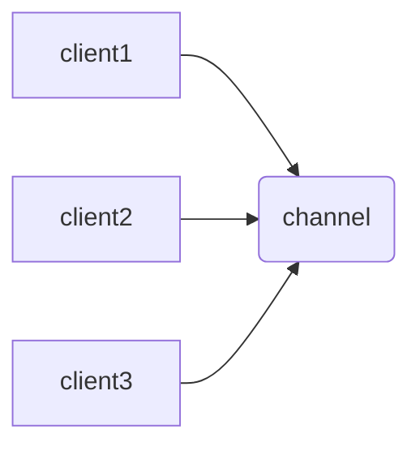
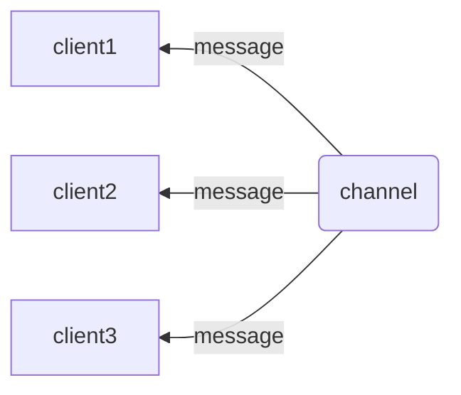

# Redis基础

Redis是完全开源免费的，是一个高性能的**key-value**数据库。基于内存亦可持久化的日志型数据结构服务器。

		* 持数据的持久化，可以将内存中的数据保存在磁盘磁盘中，重启的时候可以再次加再进行使用。
		* 支持string,list,zset,hash,String,stream数据结构。
		* 支持数据的备份（主从模式）

---


## 优势

性能及高，读速度每秒十万次，写速度每秒八万次。

丰富的数据类型*（string,list,zset,hash,5.0加入stream）。*

所有操作均是原子性的，(单个操作是原子性，多操作也支持事务）。

支持publish/subscribe，通知，key过期。

---


##  与其它key-value 存储有什么不同

复杂的数据结构，并提供原子操作，运行在内存中但是可以持久化到磁盘，*所以在对不同的数据进行高速读写时要权衡内存的大小* 。


下载地址：[Redis-5.0](http://download.redis.io/releases/redis-5.0.8.tar.gz)

或者 ```# wget http://download.redis.io/releases/redis-5.0.8.tar.gz```

```
# yum -y install gcc gcc-c++ tcl
# tar -zxvf redis-5.0.8.tar.gz -C /usr/local/
# cd /usr/local/redis-5.0.8/
# make
```

*此后会提示# **make test***

测试一下时间会比较长，缺软件会有提示。没有的话就可以下一步安装了。

```
# make install
```

此时在目录下的src里有**redis-server** 可以开启redis服务(可以指定配置文件)，在开启前我需要对配置文件做一些修改，方便我们一会使用。

在解压的文件夹里就有其配置文件，在修改前我们先备份一下

```
# cp redis.conf  redis.conf.bak
# vim redis.conf
```

>修改内容：
>
>#指定 redis 只接收来自于该 IP 地址的请求，如果不进行设置，那么将处理所有请求
>
>#bind 127.0.0.1
>
>#是否开启保护模式，默认开启。要是配置里没有指定bind和密码。开启该参数后，redis只会本地进行访问，拒绝外部访问。
>protected-mode yes
>
>#是否在后台执行，yes：后台运行；no：不是后台运行
>daemonize yes
>
>#redis监听的端口号  **不要默认真的不要默认会被黑客攻击的！**
>
>port 6309
>
>#开启客户端密码验证
>
>requirepass  <你的密码：我在这里是*qwer1234*>
>
>
>
>**【此后会有详解配置文件的教学】**
>
>

修改完成后就可以运行啦

```
# ./redis-server ../redis.conf
# ps -ef | grep redis
```

其默认端口为**63079**

登录redis为  ****

```
# ./redis-cli -p 63079 -a 'qwer1234'
127.0.0.1:63079> PING
PONG
```

---


## 数据类型

### 1.String：

 最基本的数据类型，一个*key*对应一个*value*，**string**可以包含任何数据，包括jpg图片和序列化的对象。**最大能存储512MB的数据**。

```
127.0.0.1:63079> SET var1 "这是一个string类型的数据"
OK
127.0.0.1:63079> GET var1
"\xe8\xbf\x99\xe6\x98\xaf\xe4\xb8\x80\xe4\xb8\xaastring\xe7\xb1\xbb\xe5\x9e\x8b\xe7\x9a\x84\xe6\x95\xb0\xe6\x8d\xae"

```
在登陆时使用**--raw**参数可以防止中文乱码，【其实没有乱码】。
```
./redis-cli  -p 63079 -a 'qwer1234' --raw
127.0.0.1:63079> GET var1 
这是一个string类型的数据
```
从这里知道**GET** 和 **SET** 命令时用来定义和读取key的。(可大写，可小写)
补充 **DEL**是用来删除key的

### 2.Hash：
 一个键值对应一对集合，**hash**是一个string类型的field和value的映射表，特别适合存储对象。

```
127.0.0.1:63079> HMSET var2 field1 "值1" field2 "值2"
OK
127.0.0.1:63079> HMGET var2 field1
值1
127.0.0.1:63079> HMGET var2 field2
值2
127.0.0.1:63079> HMGET var2 
ERR wrong number of arguments for 'hmget' command
```

**HMSET **和**HMGET**用于hash的操作。每个hash可以存储2的32次方个键值对。


## 3.List:

字符串列表，按照插入顺序排序，你可以添加元素到列头或者列尾。

```
127.0.0.1:63079> LPUSH var3 "123"
1
127.0.0.1:63079> LPUSH var3 "abc"
2
127.0.0.1:63079> LPUSH var3 "ABC"
3
127.0.0.1:63079> LRANGE var3 0 1
ABC
abc
127.0.0.1:63079> LRANGE var3 0 
ERR wrong number of arguments for 'lrange' command

127.0.0.1:63079> LRANGE var3 0 3
ABC
abc
123
127.0.0.1:63079> LRANGE var3 0 4
ABC
abc
123
127.0.0.1:63079> LRANGE var3 0 0
ABC
127.0.0.1:63079> 

```


**LPUSH **和**LRANGE**用于hash的操作。每个hash可以存储2的32次方个键值对。


## 4.Set:

集合通过哈希表实现string类型的无序集合，所以增删查的复杂度都是O(1).

```
127.0.0.1:63079> SADD var4 abc
1
127.0.0.1:63079> SADD var4 def
1
127.0.0.1:63079> SADD var4 123
1
127.0.0.1:63079> SADD var4 890
1
127.0.0.1:63079> SMEMBERS var4
890
123
abc
def
```

其次集合元素是唯一性原则，所以插入相同的元素是没有效果的。


## 5.ZSET:

有序集合和集合一样，不允许有重复元素。每个元素都会关联一个double类型的分数，使得集合中的成员进行从小到大的排序。

```
127.0.0.1:63079> ZADD var5 0 "第一次添加"
1
127.0.0.1:63079> ZADD var5 5 "第二次添加"
0
127.0.0.1:63079> ZADD var5 4 "第三次添加"
0
127.0.0.1:63079> ZADD var5 2 "第四次添加"
0
127.0.0.1:63079> ZRANGEBYSCORE var5 0 100
第一次添加
第四次添加
第三次添加
第二次添加

```


|  类型  | 简介                                                   | 特性                                                         | 场景                                                         |
| :----: | ------------------------------------------------------ | ------------------------------------------------------------ | ------------------------------------------------------------ |
| string | 二进制安全                                             | 可以包含任何数据,比如jpg图片或者序列化的对象,一个键最大能存储512M | every，【数字也行比如点赞数】                                |
|  hash  | 键值对集合                                             | 适合存储对象,并且可以像数据库中update一个属性一样只修改某一项属性值(Memcached中需要取出整个字符串反序列化成对象修改完再序列化存回去) | 存储、读取、修改用户属性                                     |
|  list  | 链表(双向链表)                                         | 增删快,提供了操作某一段元素的API                             | 1,最新消息排行等功能(比如朋友圈的时间线) 2,消息队列          |
|  set   | 哈希表实现,元素不重复                                  | 1、添加、删除,查找的复杂度都是O(1) 2、为集合提供了求交集、并集、差集等操作 | 1、共同好友 2、利用唯一性,统计访问网站的所有独立ip 3、好友推荐时,根据tag求交集,大于某个阈值就可以推荐 |
|  zset  | 将Set中的元素增加一个权重参数score,元素按score有序排列 | 数据插入集合时,已经进行天然排序                              | 1、排行榜 2、带权重的消息队列                                |

注意：Redis支持多个数据库，并且每个数据库的数据是隔离的不能共享，并且基于单机才有，如果是集群就没有数据库的概念。


## 6.HyperLogLog

​	做基数统计算法，优点【**再输入元素的数量或者体积非常非常大的时候，计算基数的空间总是固定的**】

每个 HyperLogLog 键只需要花费 12 KB 内存，就可以计算接近 2^64 个不同元素的基 数。这和计算基数时，元素越多耗费内存就越多的集合形成鲜明对比。

但是，因为 HyperLogLog 只会根据输入元素来计算基数，而不会储存输入元素本身，所以 HyperLogLog 不能像集合那样，返回输入的各个元素。

比如数据集 {1, 3, 5, 7, 5, 7, 8}， 那么这个数据集的基数集为 {1, 3, 5 ,7, 8}, 基数(不重复元素)为5。 基数估计就是在误差可接受的范围内，快速计算基数。

```
127.0.0.1:63079> PFADD var1 "A" "B" "C"
(integer) 1
127.0.0.1:63079> PFADD var1  "c"
(integer) 1
127.0.0.1:63079> PFADD var1  "w" "a" "w" "w"
(integer) 1
127.0.0.1:63079> PFCOUNT var1
(integer) 6

```

**PFADD** 是添加指定的元素到HyperLogLog 

**PFCOUNT** 返回给定的HyperLogLog 基数估计值


## 7.发布订阅

Redis 发布订阅(pub/sub)是一种消息通信模式：发送者(pub)发送消息，订阅者(sub)接收消息。

Redis 客户端可以订阅任意数量的频道。

下图展示了频道 channel1 ， 以及订阅这个频道的三个客户端 —— client1 、 client2 和 client3 之间的关系：






在终端输入subscribe  *<信息管道>*

```
127.0.0.1:63079> subscribe chat1
Reading messages... (press Ctrl-C to quit)
1) "subscribe"
2) "chat1"
3) (integer) 1

```

这个管道就存在了并且当前客户端就在这个信息管道中，我们**我们重新开一个客户端**向管道内发送消息，原来的客户端便可以收到

**新的客户端**

```
[root@VM_48_15_centos ~]# redis-cli -p 63079 -a qwer1234
Warning: Using a password with '-a' or '-u' option on the command line interface may not be safe.
127.0.0.1:63079> ping
PONG
127.0.0.1:63079> PUBLISH chat1 "hello i am t2"
(integer) 1

```


**旧的在管道里的客户端收到的消息**

````
1) "message"
2) "chat1"
3) "hello i am t2"
````


PSUBSCRIBE pattern [pattern ...]
订阅一个或多个符合给定模式的频道。

PUBSUB subcommand [argument [argument ...]]
查看订阅与发布系统状态。

PUBLISH channel message
将信息发送到指定的频道。

PUNSUBSCRIBE [pattern [pattern ...]]
退订所有给定模式的频道。

SUBSCRIBE channel [channel ...]
订阅给定的一个或多个频道的信息。

UNSUBSCRIBE [channel [channel ...]]
指退订给定的频道。


----


## 远程登录

```
# redis-cli -h host -p port -a password 
```

----


